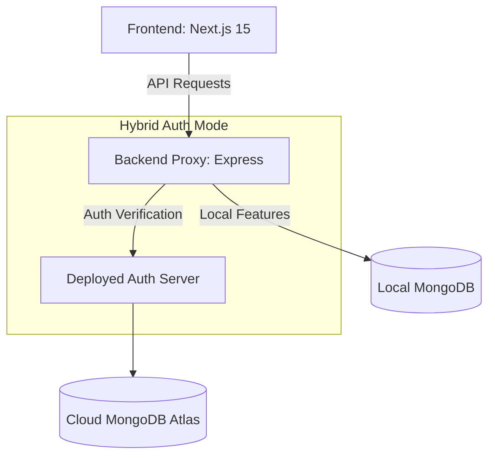

# 💼 Job Listing Portal

A professional, full-stack MERN application connecting top-tier talent with world-class organizations. Built with **Next.js 15 (App Router)**, **Express**, and **MongoDB**.

---

## 🏗️ Architecture Overview

The project follows a **Feature-Based Architecture** on the backend and uses a **Hybrid Auth Architecture** to facilitate seamless collaboration across different environments.



### Folder Structure
- **`frontend/`**: Next.js 15 application with a modern, glassmorphic UI.
- **`backend/`**: Modular architecture where each feature (auth, jobs, apps, profile) is self-contained.

---

## 🚀 Key Features

- **Advanced Search**: Filter by keywords [title/company], location, and multiple job types.
- **Role-Based Experience**: Distinct dashboards and permissions for Candidates and Employers.
- **Real-Time Dashboards**: Instant statistics on applications, job status, and profile completeness.
- **Profile Management**: Structured profile builder with Cloudinary-powered file uploads (Logo, Avatar, Resume).
- **Silent Token Refresh**: Automatic session extension for a frictionless user experience.
- **SEO Optimized**: Dynamic metadata, robots.txt, and sitemap generation for maximum visibility.

---

## 📡 API Documentation

| Endpoint | Method | Auth | Description |
|---|---|---|---|
| `/auth/signup` | POST | Public | Register a new Candidate or Employer |
| `/auth/login` | POST | Public | Authenticate and receive JWT |
| `/auth/refresh` | POST | Public | Silent refresh of access token via cookie |
| `/auth/me` | GET | Private | Get currently authenticated user profile |
| `/jobs` | GET | Public | Get paginated list of all jobs |
| `/jobs/:id` | GET | Public | Get detailed information for a specific job |
| `/jobs` | POST | Employer | Post a new job opportunity |
| `/search` | GET | Public | Advanced search with filters and sorting |
| `/applications/:jobId` | POST | Candidate| Apply for a job (requires resume) |
| `/applications/me` | GET | Candidate| View your application history |
| `/dashboard` | GET | Private | Statistical summary for current user role |

---

## 🤝 Collaboration Workflow

We use a **Hybrid Workflow** to ensure security (no shared secrets) while allowing easy collaboration.

### Role 1: Frontend Developer (Zero Config)
- Connects automatically to the **Deployed Backend API**.
- Use production-like data without running any backend locally.

### Role 2: Backend Developer (Isolated Dev)
- Runs server against **Local MongoDB**.
- Uses **Remote Auth Verification**: Local backend trusts production tokens by verifying them against the lead server.
- Allows building features like "Profile" or "Jobs" locally while using "Auth" from production.

---

## 🛠️ Environment Variables

### Backend (`.env`)
- `MONGO_URI`: MongoDB Atlas connection string.
- `JWT_SECRET`: Secret key for JWT signing.
- `CLOUDINARY_CLOUD_NAME`, `API_KEY`, `API_SECRET`: Media storage credentials.
- `FRONTEND_URL`: For CORS whitelist.

### Frontend (`.env.local`)
- `NEXT_PUBLIC_API_URL`: URL of the backend API.

---

## 📦 Getting Started

### Backend
```bash
npm install
npm run dev
```

### Frontend
```bash
npm install
npm run dev
```

---

## 📄 License
MIT License. Created for the Community.
